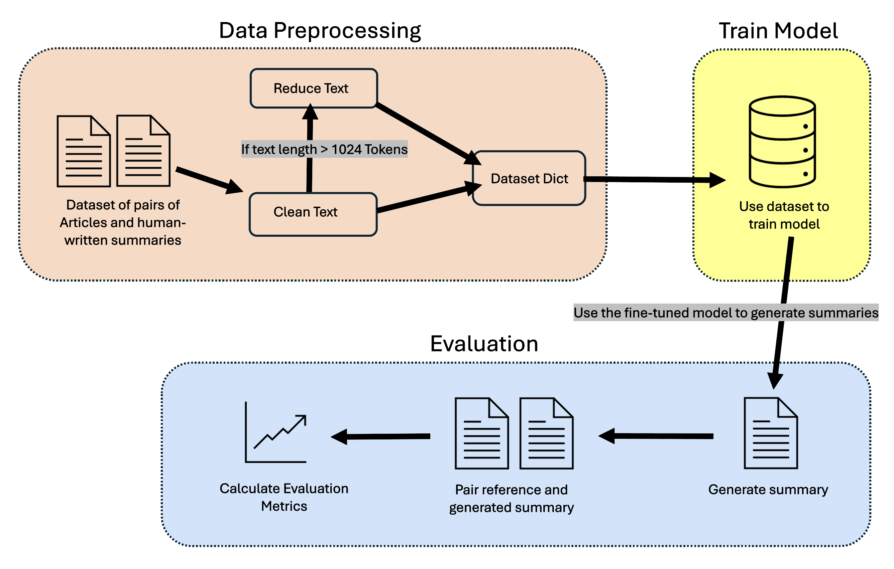
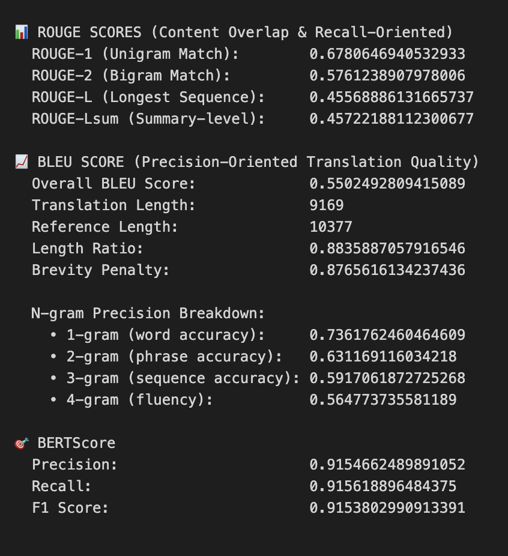

# 🗞️ News Articles Summariser

A custom abstractive summarization model fine-tuned to generate concise and accurate summaries of news articles. The model utilizes the pre-trained BART (Bidirectional and Auto-Regressive Transformer) architecture, specifically [facebook/bart-large-cnn](https://huggingface.co/facebook/bart-large-cnn), and has been trained on a curated [dataset](/training_dataset) of 511 news articles paired with human-written summaries. The model's performance is evaluated using ROUGE, BLEU, and BERTScore metrics to assess both lexical overlap and semantic matches.

## 📌 Contents
* [🚀 Instructions to run code](#-instructions-to-run-code)
    * [📁 About Dataset](#-about-dataset)
* [💽 About Model](#-about-model)
    * [👍 Model Choice](#-model-choice)
    * [🔨Method](#-method)
        * [Data preprocess](#1-data-preprocessing)
        * [Training](#2-model-training)
        * [Evaluation](#3-evaluation)
    * [🔎 Evaluation Results](#-evaluation-results)
* [🔗 Links](#-links)

## 🚀 Instructions to run code
All instructions and code paths depend on whether you're running locally or in a cloud notebook environment such as Google Colab.

* Download and open project files using IDE of choice
* If on Local machine:

    * Make sure Python and pip are installed
    * Install required libraries: `pip install -r requirements.txt`

* Open main.ipynb and sequentially follow file instructions.
_While the file contains additional information on code choices, comments made in code_

### 📁 About Dataset
The original dataset is included on the repositry.

If you would like to use your own dataset, a compatible folder layout would look like the following; where the number of articles coresponds with the same number summary.
```
dataset
├── Articles
│   └── 001.txt
|   ├── 002.txt
|   ...
|   └── 511.txt
└── Summary
    └── 001.txt
    ├── 002.txt
    ...
    └── 511.txt
```
Please bear in mind, in colab you will have to take several extra steps:
* Save the dataset folder as a zip file
* Upload to the current colab workspace as a zip file
* Unzip via following
```
!unzip /content/dataset.zip
```
* OR create folders and populate with files

## 💽 About Model
### 👍 Model choice

Abstractive methods produce more fluent, human-like summaries, whereas extractive methods often result in disjointed or unreadable output. Because this BART model is fine-tuned specifically on news articles, its capabilities align closely with the requirements of my task. 

`facebook/bart-large-cnn` BART model is pre-trained on English and fine-tuned on CNN/Daily Mail conducts abstractive summarisation approach using supervised learning. Its domain-specific fine-tuning on news content made it the most practical and effective choice for this project. 
The model also handles larger inputs up to 1024 tokens, offering strong summarisation performance, and remains computationally efficient.

### 🔨 Method
This is a diagram of the models workflow:



#### 1. Data Preprocessing
* **Text Cleaning**: Text is preprocessed removing unecessary characters while preserving punctuation and grammatical structure which is essential for coherent summarization
* **Length Management**: Articles exceeding the 1024-token limit are reduced using TF-IDF vectorization, which ranks sentences by importance, retaining the most relevant content while preserving original sentence order
* **Dataset Preparation**: Preprocessed articles and summaries are split into training (80%), validation (10%), and test (10%).
#### 2. Model training
* `facebook/bart-large-cnn` is trained on training and validation dataset which results in a fine tuned model
* The pre-trained `facebook/bart-large-cnn` model is fine-tuned on the training dataset with validation monitoring.
* _Please see [main file](main.ipynb) for Hyperparameters tuning and reasoning_

#### 3. Evaluation
* This model is then utilised to generate summaries for the test dataset
* generated and reference sumnmaries are compared for evaluation.
* Multiple evaluation metrics are utilised. This model includes:
    1. ROUGE - ROUGE-1 / ROUGE-2 / ROUGE-L / ROUGE-Lsum
    2. BLEU - Overall BLEU Score / Translation Length / Reference Length / Length Ratio / Brevity Penalty / N-gram Precision
    3. BERTScore - Precision / Recall / f1
* _Please see [main file](main.ipynb) to read what each value means for the model_
## 🔎 Evaluation results
This is a sample of the model's evaluation results.


## 🔗 Links

* [facebook/bart-large-cnn](https://huggingface.co/facebook/bart-large-cnn)
* [BERTScore](https://arxiv.org/pdf/1904.09675)

